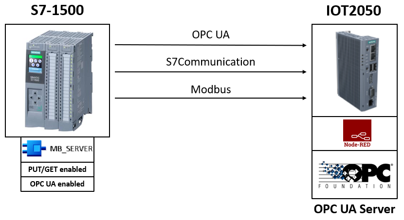

# **IOT2050 Node-Red OPCUA-Server**

- [**IOT2050 Node-Red OPCUA-Server**](#iot2050-noder-red-opcua-server)
  - [**Overview**](#overview)
    - [**Used Components**](#used-components)
    - [**Goal**](#goal)
    - [**Installation and configuration**](#installation-and-configuration)
  - [**Related Links**](#related-links)
  - [**Contribution and Contribution License Agreement**](#contribution-and-contribution-license-agreement)
  - [**Licence and Legal Information**](#licence-and-legal-information)

## **Overview**

The application describes how data can be stored, structured and read out on a local OPC UA server built with Node-Red. The data used are read out from an S7 PLC using the following protocols:

- S7 Communication
- Modbus TCP
- OPC UA

### **Used Components**

This Example was created using the following Software:

- **On Windows:**
  - TIA Portal V16 or V17
  - S7-PLCSIM Advanced V3.0
  - optional: UaExpert V1.5.1
- **On Debian (IOT2050):**
  - Node-Red

The Tests were executed on the following Hardware:

- SIMATIC IOT2050
- SIMATIC S7-1500 (simulated)

### **Goal**

After working through the following documents, you will know how to:

- Use different protocols to read values from a S7-1500 PLC
- Build a OPC UA Server on the IOT2050 with Node-Red
- Store the transferred values on the OPC UA Server
- Read the values from the OPC UA Server via Node-Red and UaExpert

### **Installation and configuration**

Use the following documents for the configuration of the IOT2050 and S7-1500:

- [Setting up of the simulated S7-PLC](docs/README_SIMULATEDPLC.md)
- [Configuration of the TIA Project](docs/README_TIAPROJECT.md)
- [Setting up of the IOT2050 & Configuration of the Node-Red Flow](docs/README_IOT2050SETUP_NODEREDFLOW.md)

## **Related Links**

||Topic|
|-|-|
|1|SIMATIC IOT2050 forum: [https://support.industry.siemens.com/tf/ww/en/threads/309](https://support.industry.siemens.com/tf/ww/en/threads/309)|
|2|SIMATIC IOT2050 Getting Started: [https://support.industry.siemens.com/tf/ww/en/posts/238945/](https://support.industry.siemens.com/tf/ww/en/posts/238945/)|
|3|Operating Instructions: [https://support.industry.siemens.com/cs/ww/en/view/109779016](https://support.industry.siemens.com/cs/ww/en/view/109779016)|

## Contribution and Contribution License Agreement

Thanks for your interest in contributing. Anybody is free to report bugs, unclear documentation, and other problems regarding this repository in the Issues section or, even better, is free to propose any changes to this repository using Merge Requests. For more information please check the [Contribution License Agreement](docs/Siemens_CLA.pdf).

## **Licence and Legal Information**

Please read the [Legal information](LICENSE.md).
