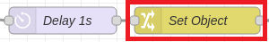

# **IOT2050 Setup & Node-Red Flow**

- [**IOT2050 Setup & Node-Red Flow**](#iot2050-setup--node-red-flow)
  - [**Prepare the IOT2050**](#prepare-the-iot2050)
  - [**Overview**](#overview)
    - [**OPC UA Server & Building Structure in OPC UA**](#opc-ua-server--building-structure-in-opc-ua)
    - [**Read/Write OPC UA**](#readwrite-opc-ua)
    - [**Read/Write S7 Communication**](#readwrite-s7-communication)
    - [**Read/Write Modbus**](#readwrite-modbus)
  - [**Node-Red**](#node-red)
  - [**Required packages**](#required-packages)
  - [**Import Node-Red Flow**](#import-node-red-flow)
  - [**Configuration of the Node-Red Flow**](#configuration-of-the-node-red-flow)
  - [**Build the OPC UA structure**](#build-the-opc-ua-structure)
  - [**Using UaExpert for monitoring**](#using-uaexpert-for-monitoring)

## **Prepare the IOT2050**

Follow [SIMATIC_IOT2050_Setting_up.md](https://github.com/SIMATICmeetsLinux/IOT2050-SmartFarming-Application/blob/main/docs/SIMATIC_IOT2050_setting_up.md) for the following steps:

- Installing the SD-Card Example Image (in this example the image V1.2.1 was used)
- First commissioning of the SIMATIC IOT2050: Remote access with Putty SSH Connection
- Working internet connection on the IOT2050 (only necessary [if not all required packages in Node-Red are installed](#required-packages))

## **Overview**

The following illustrations show the complete Node-RED flow needed to read data from the PLC using S7 communication, Modbus TCP and OPC UA. In addition, the flow contains all components to create an OPC-UA server, to build a server structure and to store the read variables in it.

### **OPC UA Server & Building Structure in OPC UA**

### **Read/Write OPC UA**

### **Read/Write S7 Communication**

### **Read/Write Modbus**

## **Node-Red**

On the Example Image V1.2.1 (used in this manual) Node-Red is already preinstalled and autostart is enabled. To access it, open a browser on your PC connected to the IOT2050 and open the URL `http://<IP of the IOT2050>:1880/`.

## **Required packages**

For the application some packages are required:

- node-red-contrib-s7 (V 3.0.0)
- node-red-contrib-modbus (V 5.14.1)
- node-red-contrib-opcua (V 0.2.265)

The packages are already installed on the Example Image V1.2.1. If not, they can be installed as follows: Open a browser on your PC connected to the IOT2050 and open the URL `http://<IP of the IOT2050>:1880/`.

    Menu -> Manage palette -> Switch to the tab "Install" -> Search for the package -> Click install

The "node-red-contrib-opcua"-package must be updated to the version 0.2.265. To do this, open a Putty connection and use the following command:

    npm install -g node-red-contrib-opcua@0.2.265

You should see the following packages in the "Manage Palette"-Menu:

## **Import Node-Red Flow**

Download the ready-made JSON-FIle: [IOTDataCollectorOPCUA-Flow.json](../src/IOTDataCollectorOPCUA-Flow.json)

Import the flow:

    Menu -> Import -> Select a file to import -> Press the Import-Button

## **Configuration of the Node-Red Flow**

If you used other network settings for the PLC, these must be adjusted in the following nodes:

|Node Type|Node|Command|
|-|-|-|
|3x s7 in (BOOL, REAL & INT|| Double-Click on the node -> Click on the pen-symbol next to "PLC" -> Set the connection parameters (Nb. S7 1200/1500 uses Slot 1 and S7 300/400 uses Slot 2)|
|modbus getter|| Double-Click on the node -> Click on the pen-symbol next to "Server" -> Set the connection parameters (default port number is 503)|
|3x OPC UA client (Client for IOT_BOOL, IOT_REAL & IOT_INT)||Double-Click on the node -> Click on the pen-symbol next to "Endpoint" -> Set the connection parameters (make sure you do this for each of the four nodes)|

The server settings for the local OPC UA Server (on the IOT2050) are set to *localhost* by default.

To implement changes press the deploy-button in the upper right corner.

## **Build the OPC UA structure**

After completing all settings press the "Deploy"-Button in the upper right corner.The flow now starts to read data from the PLC and tries to write them to the created OPC UA server. For this, the architecture of the server must be created (This must be done every time the flow or the server is restarted.): Press the inject button and wait a few seconds (If the debug output is activated, the following messages are displayed).

The following processes are now running in the background:

|Node|Command|
|-|-|
|| The "Create Object"-Node uses the OPC UA command "addFolder" to generate a new folder called "IOTData" on the namespace 5 of the local OPC UA server|
|| In the subflows the "Set Object"-Node uses the OPC UA command "setFolder" to select the newly created folder "IOTData" on the namespace 5 for further actions|
|| In the subflows the "Create Object"-Node uses the OPC UA command "addFolder" to generate a new subfolder called "Modbus", "S7" or "OPC UA" in the "IOTData"-folder on the namespace 5 of the local OPC UA server|
|| In the subflows the "Set Object"-Node uses the OPC UA command "setFolder" to select the newly created subfolder "Modbus", "S7" or "OPC UA" in the "IOTData"-folder on the namespace 5 for further actions|
|| In the subflows the Add-Nodes use the OPC UA command "addVariable" to generate new variables with different datatypes in the subfolders|

The process is running step-by-step through the three subflows "Modbus", "S7" and "OPC UA" until the whole structure is built. The structure can be viewed under [Using UaExpert for monitoring](#using-uaexpert-for-monitoring). Afterwards, the values read from the local OPC UA server on the IOT2050 should be successfully displayed in the debug window.

## **Using UaExpert for monitoring**

This part is optional. With the help of UaExpert the server structure and the stored values of the OPC UA Server can be monitored live.

Download UaExpert [here](https://www.unified-automation.com/products/development-tools/uaexpert.html) (in our example version V1.5.1 was used).

Complete all settings, start the OPC UA Server and [create the structure of the server](#build-the-opc-ua-structure). Open UaExpert and create a new connection:

Accept the server certificate:

After a successful connection, the individual nodes can be dragged into the Data Access View with the mouse and viewed live there:

