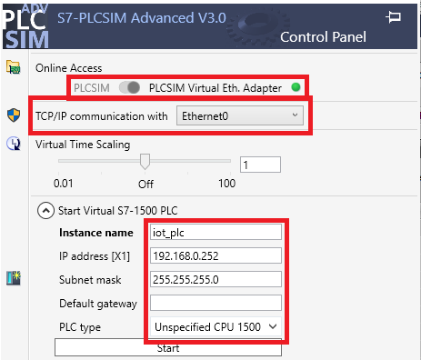
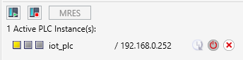

# **Simulated PLC**

- [**Simulated PLC**](#simulated-plc)
  - [Download and Install S7-PLCSIM Advanced](#download-and-install-s7-plcsim-advanced)
  - [Setting up the simulated PLC](#setting-up-the-simulated-plc)

## Download and Install S7-PLCSIM Advanced

In this example, a simulated S7-1500 controller is used. This is created using the software *S7-PLCSIM Advanced*: You can download a trial-version [here](https://support.industry.siemens.com/cs/de/en/view/109795016/en) (version 3.0 was used in this example).

## Setting up the simulated PLC

Open the application and adjust the configurations as follows (The IP address 192.168.0.252 is used in the provided TIA example project - If a different IP address is used here, it must be adapted here, in the TIA-Portal and in the Node-Red configurations / The interface connected to the IOT2050 must be selected for the "TCP/IP communication with..."):

Press "Start". The PLC is now active and can be used in the TIA Portal.

The next step is to set up the TIA-Portal: [Configuration of the TIA Project](README_TIAPROJECT.md)
