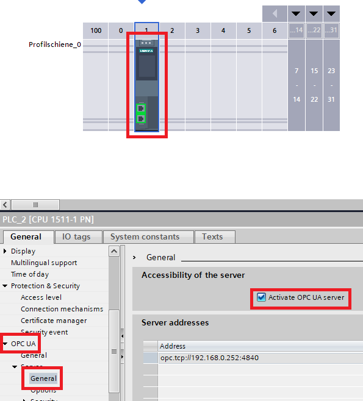

# **TIA Portal Project**

- [**TIA Portal Project**](#tia-portal-project)
  - [**Download the TIA Portal Project-File**](#download-the-tia-portal-project-file)
  - [**Use of the provided TIA portal project**](#use-of-the-provided-tia-portal-project)
  - [**Generation of Test Values**](#generation-of-test-values)
  - [**S7 Communication**](#s7-communication)
    - [Optimized Block Access](#optimized-block-access)
    - [PUT/GET Communication](#putget-communication)
  - [**Modbus TCP Communication**](#modbus-tcp-communication)
    - [MB_SERVER](#mb_server)
    - [Connection Parameters](#connection-parameters)
    - [Converting Values](#converting-values)
  - [**OPC UA Communication**](#opc-ua-communication)
    - [OPC UA Server](#opc-ua-server)
    - [Access variables from OPC UA](#access-variables-from-opc-ua)
  - [**Activate support for simulation**](#activate-support-for-simulation)
  - [**Load Project on the simulated PLC**](#load-project-on-the-simulated-plc)

## **Download the TIA Portal Project-File**

- TIA-Portal v16: [OPCUA.zap16](../src/OPCUA_V16.zap16)
- TIA-Portal v17: -

## **Use of the provided TIA portal project**

The following document shows the necessary configurations of the TIA project. If you use the provided TIA project all the following configurations are already made. Make sure that the IOT2050 and the (simulated) PLC are in the same subnet. To set the IP Address of the PLC you must open the device view and select the PROFINET Interface. In the properties tab go to *Ethernet addresses*.

The IP address 192.168.0.252 is preset for the simulated S7 controller. If a different IP address is used here, it must be adapted in the Node-Red configurations.

If you have used this way you can start directly with the [Setting up of the IOT2050 & Node-Red](README_IOT2050SETUP_NODEREDFLOW.md)

## **Generation of Test Values**

The following instructions show how the data for the OPC UA server is generated and read out from the S7-PLC. The data types in question are the following:

- Bool
- Int
- Real

The generation of the test values is done in a Function Block named (FB_IOTDataGenerator). The values are stored in different Data Blocks depending on the used communication protocol.

The *Real* value is represented by a sinus function. The *Int* value is a random value and the *Bool* value is true if the Int value is greater than zero.

## **S7 Communication**

To be able to establish a S7 communication between the IOT2050 and S7-1500, some settings are required:

### Optimized Block Access

For the IOT2050 to be able to read the variables stored in the DB, you need to disable the optimized block access.

To do so, right click on the DB and select properties. In the appearing dialog select *Attributes* and uncheck the option.

### PUT/GET Communication

You also need to enable the PUT/GET access because otherwise the PLC would block any attempts to access the DB.

Open the device view and select the PLC. In the properties tab go to *Protection & Security → Connection mechanisms* and check the option.

**WARNING:** Please be aware that by enabling the PUT/GET communication you are allowing any application using this method to access the data on your PLC.

## **Modbus TCP Communication**

The Modbus TCP communication requires that a Modbus server is implemented on the PLC side. This server processes the requests from the Modbus client running on the IOT2050.

### MB_SERVER

In the standard communication instructions, you can find the MB_SERVER instruction, that creates a Modbus TCP Server on the S7-1500.

### Connection Parameters

The connection parameters are described using the TCON_IP_v4 structure. Some of the parameters required are the HW_ID of the PROFINET interface used for the communication. The type of the connection (here 11 for TCP/IP). The IP address of the client is set in the ADDR array. You can also use the IP address 0.0.0.0 to accept requests from any client.

### Converting Values

The read data is stored in the holding register of the Modbus server. The holding register is represented by an array of words, so the data must be converted to an array of words before it can be sent to the client. This is done in the function FC_SetHoldingRegisterData using conversion and shifting functions.

**NOTE:** Please refer to the TIA Portal help for more information on the MB_SERVER instruction and the TCON_IP_v4 structure.

## **OPC UA Communication**

To access variables using OPC UA, two settings must be made. First you have to enable the OPC server. After that you have to make the variables accessible from OPC UA.

### OPC UA Server

To enable the OPC UA server, open the device view and select the PLC. In the properties tab go to *OPC UA → Server* and activate the function by selecting the checkbox.

### Access variables from OPC UA

Normally the access from OPC UA is enabled by default, otherwise you can enable it by opening the DB and selecting the checkbox in the column *Accessible from HMI /OPC UA*.

## **Activate support for simulation**

Since a simulated control is used in this example, the support for this must be activated: Right click on the project name -> Switch to the "Protection" tab -> Activate the checkbox -> Press "Ok"

## **Load Project on the simulated PLC**

After completion, the project can be loaded into the simulated PLC:

When this has been done successfully, the status light of the PLC in S7-PLCSIM Advanced changes to green:

The next step is to set up the IOT2050: [README_IOT2050SETUP_NODEREDFLOW](README_IOT2050SETUP_NODEREDFLOW.md)
